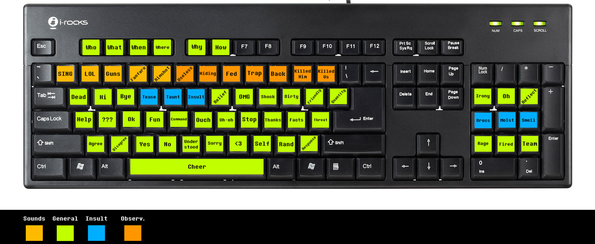

# Second keyboard soundboard

## History

I was inspired some time ago to create my own soundboard. Having looked at several peripherals on the market, I found them to be costly and limited in functionality for what I wanted. I started down a rabbit hole of turning a second keyboard into a soundboard.

The primary challenge I ran into is that Windows does not distinguish between multiple keyboards. So I had to find a way to intercept keystrokes on a separate keyboard to use for playing sound files, but not have those keystrokes actually pass through and trigger other actions on the computer.

Many of the tutorials I found involved using a soundboard executable file. I ultimately scrapped this as it had one big problem - no matter how complex of a key combination I used to trigger a sound effect, it would still have some adverse affect on my system as those keystrokes had to be passed through. Additionally, even with complex key bindings, I could not get more than 3 sound files on a single key. What I actually wanted was to have each key be a category and play a random sound from a library of sounds tagged as that category.

## My solution

Through a combination of trial and error, scripting, reading, researching, etc., I finally have what I believe to be the best way to implement this setup. This project will allow you to connect a second keyboard to your computer, intercept all key strokes on that keyboard, and then have those keystrokes trigger an unlimited number of sound effects.

## WARNING

Since this project utilizes a tool that intercepts keystrokes, some games will see this as a hack and you run the risk of being banned (such as Overwatch). Please be sure that you check any history with AutoHotKey and your game of choice to see if you run a risk. As long as you disable the script before launching those games, you should be fine\*, but exercise caution.

With Overwatch in particular, AHK scripts are how folks write many existing aimbots. There is a [blue post on the Overwatch forums](https://us.forums.blizzard.com/en/overwatch/t/can-i-be-banned-for-using-autohotkey/75928/5?u=drakuloth) discussing AHK scripts, and it seems to boil down to 1 key = 1 action should be fine. My additional concern was the use of the Interception driver to stop input from my second keyboard from causing actions on my system (i.e. the letter "s" on my second keyboard plays a sound, but does not type the letter "s"). From what I've found, it looks like as long as you don't do things like move the mouse or assign multiple keypresses to a single keypress, then this should be fine.

## Required installs

This project combines several tools to get the effect that we need. Please install the below in order to get everything working:

- [Soundboard Installs/Sounds](https://squishy-soundboard.s3.us-east-2.amazonaws.com/soundboard-files.zip) - These are the main files used in the soundboard. These are in a private Amazon S3 account. You will have to reach out to me for access to these files - SquishyDough#1337 on Discord.

- [VLC Media Player](https://www.videolan.org/vlc/) - In my opinion, this is the best media player to have installed anyway. In our project, VLC is run from the command line by our AutoHotKey script to play the sound files.

- [VoiceMeeter](https://www.vb-audio.com/Voicemeeter/index.htm) - The installer I used is found at `Installs\VoicemeeterSetup`. This tool creates a virtual sound device that allows both your headset microphone AND your sound files to play through the microphone.

- [Virtual Audio Cable](https://www.vb-audio.com/Cable/) - The installer I used is found at `Installs\VBCABLE_Driver_Pack43`. This tool is made by the same folks who created VoiceMeeter. It creates an audio source for your sound files.

- [AutoHotKey](https://www.autohotkey.com/) - The installer I used is found at `Installs\AutoHotkey_1.1.32.00_setup`. This tool enables the script that intercepts and plays sound files from the second keyboard.

- [Interception Driver](http://www.oblita.com/interception) - The installer I used is found in `AHI\Interception\command line installer`.

  **Do not double-click it.**

  See below for steps and screenshot on installing it. Please take special care to install it exactly as follows:

  - Run a command prompt as administrator.
  - Browse to the `AHI\Interception\command line installer` folder.
  - Type `install-interception.exe /install`.

    

- [Audials](https://audials.com/en) - _OPTIONAL_ - I used the paid version of this tool (\$20 license at time of writing) to save YouTube videos as audio files. It gets me the audio for an entire video in a matter of seconds, which I can then chop apart for the quotes I want.

- [Audacity](https://www.audacityteam.org/) - _OPTIONAL_ - This is the tool I used to chop segments out of sound files to use in the soundboard.

- [MP3Gain](http://mp3gain.sourceforge.net/download.php) - _OPTIONAL_ - This tool helps to normalize all sound
  files to provide consistent audio levels. It doesn't do what other normalizers do and simply adjust the gain - it actually attempts to determine what the listener might consider loud and adjust around that!

## Setting up the soundboard

### Step 1: Save the soundboard script

You can either run `git clone https://github.com/joshwaiam/soundboard.git` in your terminal to clone these entire project to your computer, or you can create a folder with the `Soundboard.ahk` script in it (either download the file or copy and paste the contents)

### Step 2: Extract Soundboard files

Extract the `AHI`, `Installs`, and `Sounds` directories from the Soundboard files archive and extract them to the root directory where you cloned this repository.

### Step 3: Set up VoiceMeeter

Please see the screenshot below for my specific VoiceMeeter setup.

1. The first hardware input should be your headset microphone.

2. The second input should be the Virtual Audio Cable installed for this project.

3. For hardware out, click A1 and choose your primary sound device.

### Step 4: Update your sound devices

Please see the screenshot below for my specific sound settings.

1. Right-click your volume icon and select Open Sound Settings.

2. Output should be your primary sound device.

3. Input should be the VoiceMeeter device.

### Step 5: Get the second keyboard VID and PID

Each keyboard has a unique VID and PID. We use these in our scripts to reliably target the keyboard.

1. Plug in your second keyboard.

2. Run `AHI\Monitor.ahk`

3. Check all of the keyboard devices, then press a key on the keyboard. The output portion of the window will show the device ID of the keyboard, and you can then get the VID and PID.

   

4. Open your preferred code editor and open `Soundboard.ahk` from the project root.

5. Go to Line 9 and update the `KEYBOARD_VID` and `KEYBOARD_PID` varaibles to reflect your keyboard IDs.

6. Save the script.

## Update the additional variables in the script

You need to update a few portions in the `Soundboard.ahk` script to make it work with your system. Specifically, the variables found under CONSTANTS near the top (the same section where you added your `KEYBOARD_VID` and `KEYBOARD_PID`).

Most of these should be straight-forward, with the exception of the `VLC_AUDIO_OUT` variable.

### Determining your `VLC_AUDIO_OUT` value

1. Run VLC Media Player.

2. Go to `TOOLS -> Preferences`.

3. Click on the `Audio` tab.

4. Under Show settings, choose `All`.

5. Under the audio category on the left, expand `Output Modules` and select `WaveOut`.

6. Under the `Select Audio Device` dropdown box, look for `VoiceMeeter Input`. You need to copy what it shows in the dropdown box **EXACTLY**. There is no truncated text or anything, even though it looks like words are cut off - write down exactly what you see here.

7. Type the value from step 6 into the `VLC_AUDIO_OUT` variable in the `Soundboard.ahk` script.

## Using the soundboard

Run `Soundboard.ahk` from the root of this project folder. You should now be able to press keys on your second keyboard and have those sounds play through your mic!

## Modifying the script

The code will be commented heavily and should provide enough information for you to add your own sounds or rebind keys.

I have provided a keyboard map of my sound mapping and layout that you can use as a reference. I found a pack of small Post-It notes that came with 5 colors, and that dictates what I used in the keyboard map. I glue the Post-Its to the keys and we are in business!

